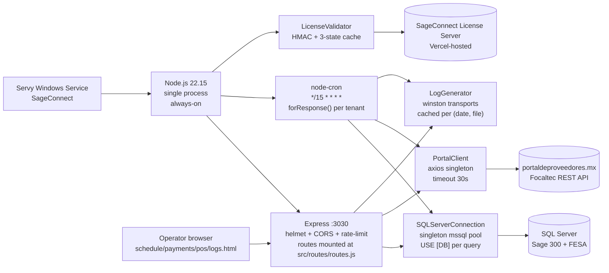

# Architecture (single-page view)

This is the orientation overview. For full layered depth — every controller, every cross-cutting concern, the always-on pattern catalog, the forensic context behind the defense-in-depth invariant — read [`.planning/codebase/ARCHITECTURE.md`](../.planning/codebase/ARCHITECTURE.md).

## Service shape



The whole service is one Node process, supervised by Servy. There is no horizontal scaling, no message queue, no worker pool — multi-tenancy lives inside `forResponse()` as a sequential loop over `config.portal.tenants`.

## Key modules (1-line responsibility each)

| Module | Responsibility |
|--------|----------------|
| `src/index.js` | Boot order: license validate (fail-fast) → `startServer(3030)` → `initScheduler()`. |
| `src/server.js` | Express app: security middleware, rate limit, `serveHtmlWithKey()` dashboard auth injection, mounts `src/routes/routes.js`. |
| `src/background.js` | `forResponse()` — per-tenant 7-step orchestration wrapped in `withStepTimeout()`. Also `startChildProcess()` for the CFDI import binary. |
| `src/config.js` | Single env loader with `validate()` + 4 range guards (lock/http/child/step). |
| `src/services/CronScheduler.js` | `initScheduler()` registers the cron task and the `lock:timeout` listener. |
| `src/services/OperationManager.js` | Concurrency lock, `stepProgress` array slot, auto-release timer, `lock:timeout` EventEmitter. |
| `src/services/LicenseValidator.js` | HMAC-SHA256 validation, 3-state cache, DNS bypass detection, admin email on failure/revocation. |
| `src/utils/SQLServerConnection.js` | Singleton mssql pool; `runQuery(query, database)` always prepends `USE [database]`. |
| `src/utils/PortalClient.js` | Singleton axios instance with `timeout = PORTAL_HTTP_TIMEOUT_MS`. |
| `src/utils/LogGenerator.js` | Winston transports cached by `(date, fileName)` — bounds FD count under always-on. |
| `src/utils/duration.js` | `withStepTimeout(promise, ms, ctx)` Promise.race wrapper. Sentinel string `'Step timeout'` is load-bearing. |

The 6 route files (`src/routes/*-routes.js`) and 10 controllers (`src/controller/*.js`) implement the surface area on top of these primitives.

## Defense-in-depth timeouts

```
axios (30s)  <  step (5m)  <  child (10m)  <  lock (14m)
```

Enforced by range guards in `src/config.js:186-208`. Breaking the order — making any tier loose enough to cross the next tier — is a bug. The lock auto-release at 14 min is calibrated to ~93% of the 15-min cron cadence to recover before the next tick fires.

Worked example of what each tier protects against, and what the recovery loop closed in v2.3: [`.planning/MILESTONES.md`](../.planning/MILESTONES.md) § v2.3 Scheduler Lock Recovery, and [`.planning/forensics/report-20260427-220000.md`](../.planning/forensics/report-20260427-220000.md) for the 5-bug always-on cascade that motivated the work.

## Pointers

- Layered architecture, always-on patterns, error handling, cross-cutting concerns — [`.planning/codebase/ARCHITECTURE.md`](../.planning/codebase/ARCHITECTURE.md).
- Tech debt and security risks — [`.planning/codebase/CONCERNS.md`](../.planning/codebase/CONCERNS.md).
- Conventions (naming, logging, error handling) — [`.planning/codebase/CONVENTIONS.md`](../.planning/codebase/CONVENTIONS.md).
- Tests and known-failing suites — [`.planning/codebase/TESTING.md`](../.planning/codebase/TESTING.md).
- Production deploy — [`DEPLOYMENT.md`](DEPLOYMENT.md).
- Operator runbook — [`OPERATIONS.md`](OPERATIONS.md).
